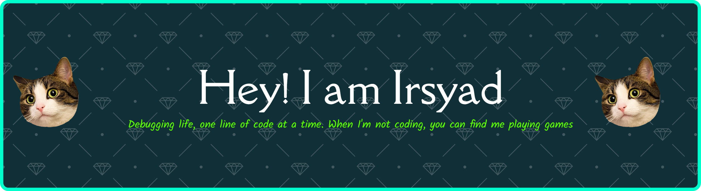

<<<<<<< HEAD
## Hello World! I'm Irsyad Irfan Habibi 👋
=======
<h3 align="left">Hi 👋! My name is Irsyad</h3>

>>>>>>> 8f00f2452bad1f9ff9f0d894b4bf5ff072a1a26f

### Skills 

  
  
  
  
  
  
  
  
  
  
  
  
  

### Connect with me

<<<<<<< HEAD
 
=======
>>>>>>> d1d7ec655fb672f99912abcc7fd23cbbbe3f3fd0